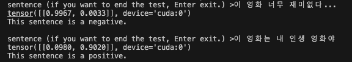
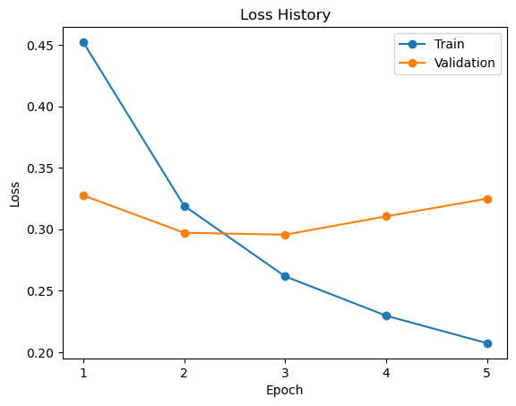

# Sentiment Analysis with BERT

BERT 논문에 대한 설명은 [블로그](https://velog.io/@khs0415p/paper-BERT)를 참고하시기 바랍니다.

## Abstract

NAVER 영화 리뷰 데이터의 감정 분석을 위한 BERT Fine-tuning 코드입니다.  
사용된 사전 학습 모델은 "bert-base-multilingual-uncased"이며, 데이터는 긍,부정 라벨링이 되어 있는 리뷰 데이터입니다.

## Dataset

dataset은 한글을 제외한 문자 및 특수 문자와 null 값을 제거하고 총 *194245*개의 행을 가진 데이터입니다.  
각 행은 리뷰, 라벨로 이루어져 있습니다.

## Tree

```
.
├── config
│   └── config.yaml
│
├── data
│   └── naver_reviews.csv
│
├── requirements.txt
│
├── models                      # folder for modeling
│   ├── __init__.py
│   └── bert.py
│
├── results                     # folder for save model
│
├── trainer
│   ├── __init__.py
│   ├── base.py                 # Base Trainer
│   └── trainer.py              # BERT Trainer
│
├── utils
│   ├── __init__.py
│   ├── data_utils.py           # dataset file
│   ├── file_utils.py           # file system file
│   └── train_utils.py          # utilities for learning
│
└── main.py                     # run file
```

## Start

### Train
```
python main.py --config config/config.yaml
```

### Test
```
python main.py --config config/config.yaml --mode test --checkpoint <checkpoint folder>
```

#### Test samples


## Results

### Loss History




